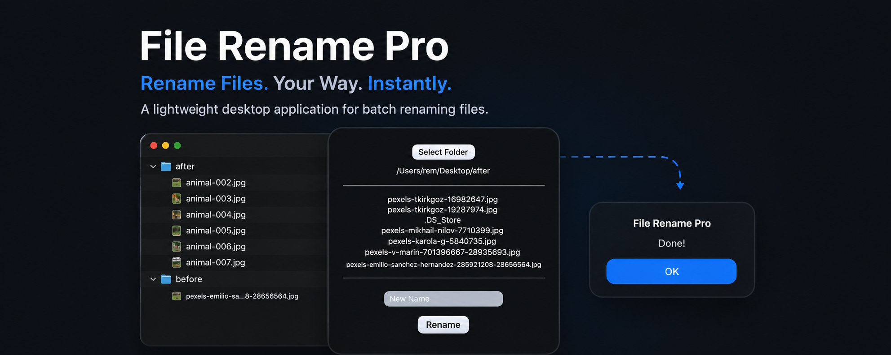

  

  <h1>File Rename Pro</h1>

  <strong>A lightweight desktop application for batch renaming files.</strong>

  

      
    
    
  

  

  <h2>Download</h2>

  

    <!--Windows 11-->
    
     
     
    <!--macOS-->
    
    
    
     
     
    <!--Linux (.AppImage)-->
    
    
     
    <!--Debian-based Linux-->
    
    
     
    <!--RHEL-based Linux-->
    
    
     
     
     
    
    
    
  

   

---

## Roadmap

- [x] Sprint 1 - Basic Rename
- [x] Sprint 2 - Preview
- [x] Sprint 3 - Deploy
- [ ] Sprint 4 - Undo
- [ ] Sprint 5 - Drag & Drop

---

## Features

### Sprint 3 (v0.3)
- [x] Icon design update and implementation
  - [x] Generate Icon with Figma and Icon Composer
- [ ] User Manual
  - [ ] PDF
  - [ ] Video (Youtube)
- [ ] Dockerized Linux Build Environments
  - [ ] Dockerfile.ubuntu (.deb | .AppImage)
    - [ ] `.\.docker\Dockerfile.ubuntu`
  - [ ] Dockerfile.fedora (.rpm | .AppImage)
    - [ ] `.\.docker\Dockerfile.fedora`
- [ ] Create Builder Project (npm-workspace)
  - [ ] `.\tools\package.json`
  - [ ] `.\tools\builder.linux.js`
  - [ ] Update npm scripts for build
    - [ ] `npm run build:window`
    - [ ] `npm run build:macOS`
    - [ ] `npm run build:linux`
- [ ] Build Installers
  - [ ] Windows 11 (x64)
  - [ ] macOS
    - [ ] Apple Silicon | arm64
    - [ ] Universal | x64 | arm64
  - [ ] Linux
    - [ ] Common (.AppImage)
      - [ ] x64
      - [ ] arm64
    - [ ] Debian-based (.deb)
      - [ ] x64
      - [ ] arm64
    - [ ] RHEL-based (.rpm)
      - [ ] x64
      - [ ] arm64
- [ ] QA
  - [ ] Windows 11
  - [ ] macOS Tahoe
  - [ ] Linux 
    - [ ] Oracle VirtualBox
    - [ ] Debian 12.15.0
    - [ ] Fedora Workstation 44
- [ ] Deploy
  - [ ] Github
  - [ ] Gumroad
  - [ ] itch.io
  - [ ] Payhip
- [ ] Posting
  - [ ] X
  - [ ] Bluesky
  - [ ] Youtube

#### Fixed
- Fixed an issue where the file name incorrectly displays as "FileRenamePro" instead of "File Rename Pro".
- Fixed a bug where renaming was still possible on the previous path after task completion.

#### Known Issues
- Top menu requires updates, particularly on macOS

### Sprint 2 (v0.2)
- [x] Preview the changes
  - [x] Prevent files starting with '.' from being added.

#### Fixed
- Fixed a bug where hidden files were unintentionally renamed.

#### Known Issues
- Real-time file detection is not supported.
- ~~A bug has been identified where renaming is still possible on the previous path, even though a reset is executed after task completion.~~

### Sprint 1 (v0.1)
- [x] Select a folder
- [x] Display File List
- [x] Rename

#### Known Issues
- ~~Hidden files are unintentionally renamed.~~

---

## Built With
- Tauri
- Vanilla (HTML/CSS/JS)